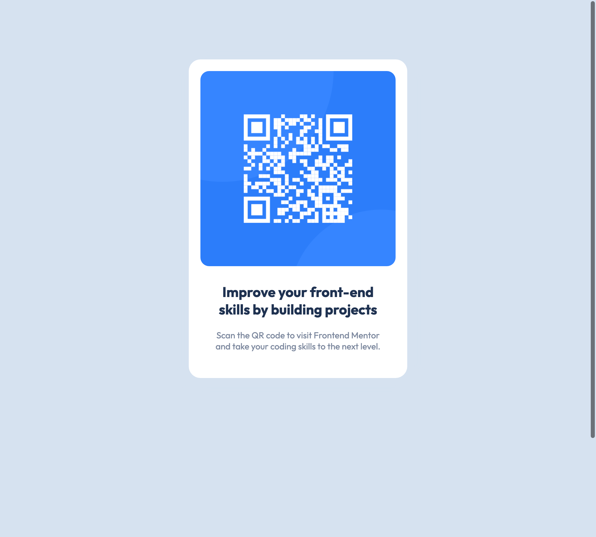

# Frontend Mentor - QR code component solution

This is a solution to the [QR code component challenge on Frontend Mentor](https://www.frontendmentor.io/challenges/qr-code-component-iux_sIO_H). Frontend Mentor challenges help you improve your coding skills by building realistic projects.

## Table of contents

- [Overview](#overview)
  - [Screenshot](#screenshot)
  - [Links](#links)
- [My process](#my-process)
  - [Built with](#built-with)
  - [What I learned](#what-i-learned)
  - [Continued development](#continued-development)
  - [Useful resources](#useful-resources)
- [Author](#author)

## Overview

### Screenshot



### Links

- [Repo URL](https://github.com/BellaLeberSmeaton/qr-code-component-main)
- [Live site URL here](https://sharp-borg-8cec42.netlify.app)

## My process

### Built with

- Semantic HTML5 markup
- CSS custom properties
- Flexbox

### What I learned

This project was a great exercise to test my flex-box learnings. Establishing the `height: 100vh` for centering horizontally and vertically with Flexbox was important in concluding this project.

Remembering flex-box on the outer container:

```css
body {
  background-color: hsl(212, 45%, 89%);
  font-family: "Outfit", sans-serif;
  max-width: 375px;
  min-height: 100vh;
  display: flex;
  flex-direction: column;
  justify-content: center;
  align-items: center;
  margin: 20px auto;
}
```

### Continued development

There are two areas I will be applying further development to:

- rem / em / and viewports
- flexbox and when to apply to parent - child.

### Useful resources

- [Better Dev resource](https://www.better.dev/centering-things-with-css-flexbox) - This helped me decide how I was going to apply flex-box with vertical and horizontal placement.

## Author

- [Bella Leber Smeaton - LinkedIn](https://www.linkedin.com/in/bella-leber-smeaton/)
